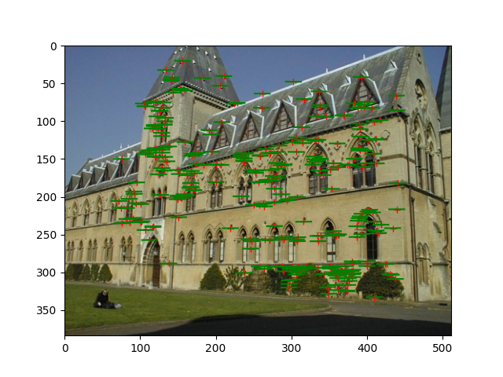
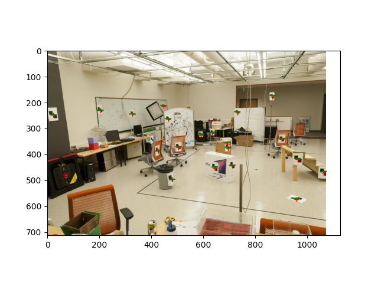

# CV_HW3_Report
王泽恺 2400013155

## 1. 点归一化（normalize_points函数）

### 1.1 数学原理
点归一化通过平移和缩放使点集分布在单位标准差附近，提高后续计算的数值稳定性。

### 1.2 计算步骤
1. **计算均值**：
   $$\mu = \frac{1}{N}\sum_{i=1}^{N} p_i$$
   其中$p_i = (x_i, y_i)$为输入点，$N$为点的数量

2. **平移点集**：
   $$\hat{p}_i = p_i - \mu$$
   使点集中心移至原点

3. **计算缩放因子**：
   $$\text{stds} = \frac{1}{N}\sum_{i=1}^{N} \|\hat{p}_i\|^2$$
   $$s = \sqrt{\frac{2}{\text{stds}}}$$
   缩放因子使点集的平均平方距离为2

4. **构建变换矩阵**：
   $$T = \begin{bmatrix} s & 0 & -s\mu_x \\ 0 & s & -s\mu_y \\ 0 & 0 & 1 \end{bmatrix}$$

5. **归一化点集**：
   $$\tilde{p}_i = s \cdot \hat{p}_i$$


## 2. 基础矩阵估计（fit_fundamental函数）

### 2.1 数学原理
基础矩阵$F$描述双目视觉中对应点的几何关系，满足对极约束：$\mathbf{x}_2^T F \mathbf{x}_1 = 0$，其中$\mathbf{x}_1, \mathbf{x}_2$为对应点的齐次坐标。

### 2.2 计算步骤（八点算法）
1. **构建约束方程**：
   对于归一化点$\mathbf{x}_1=(x_1,y_1,1)^T$和$\mathbf{x}_2=(x_2,y_2,1)^T$，约束方程展开为：
   $$x_2x_1f_{11} + x_2y_1f_{12} + x_2f_{13} + y_2x_1f_{21} + y_2y_1f_{22} + y_2f_{23} + x_1f_{31} + y_1f_{32} + f_{33} = 0$$
   对应矩阵形式$A\mathbf{f}=0$，其中：
   $$A_i = \begin{bmatrix} x_2x_1 & x_2y_1 & x_2 & y_2x_1 & y_2y_1 & y_2 & x_1 & y_1 & 1 \end{bmatrix}$$
   $\mathbf{f} = (f_{11}, f_{12}, f_{13}, f_{21}, f_{22}, f_{23}, f_{31}, f_{32}, f_{33})^T$

2. **SVD求解**：
   对矩阵$A$进行奇异值分解：$A = U\Sigma V^T$
   取$V$的最后一列作为$\mathbf{f}$的解，重构得到$F$

3. **秩2约束**：
   对$F$进行SVD分解：$F = U\Sigma V^T$，其中$\Sigma = \text{diag}(\sigma_1, \sigma_2, \sigma_3)$
   令最小奇异值为0：$\Sigma' = \text{diag}(\sigma_1, \sigma_2, 0)$
   重构基础矩阵：$F' = U\Sigma' V^T$

4. **反归一化**：
   若使用了点归一化，需进行反变换：$F = T_2^T F' T_1$
   其中$T_1, T_2$分别为左右点集的归一化矩阵
### 2.3 结果数据
#### 进行归一化后：
library组图片得到的误差2.7803287192874694e-06
lab组图片得到的误差7.3948594041949385e-06
- Library Fundamental Matrix:
  ```
  [
    [-3.44725739e-08,  7.27167745e-07, -1.09292791e-04],
    [-4.37299224e-06, -4.44216115e-08,  8.10999749e-03],
    [ 1.04291060e-03, -7.28410119e-03, -1.97254324e-01]
  ]
  ```

- Lab Fundamental Matrix:
  ```
  [
    [-1.17248591e-07,  1.60824663e-06, -4.01980786e-04],
    [ 1.11212887e-06, -2.73443755e-07,  3.23319884e-03],
    [-2.36400817e-05, -4.44404958e-03,  1.03455561e-01]
  ]
  ```
效果图：
  
  
#### 不进行归一化：
library组图片得到的误差0.00016149806538390412
lab组图片得到的误差0.003763402377063063
Library Fundamental Matrix:
```
[[-1.32341616e-06  1.36640519e-05 -6.82803870e-04]
 [-2.88178174e-05  2.66440807e-07  4.09069255e-02]
 [ 5.62362952e-03 -3.72771609e-02 -9.98451273e-01]]
 ```
Lab Fundamental Matrix:
```
[[-5.36264198e-07  7.90364771e-06 -1.88600204e-03]
 [ 8.83539184e-06  1.21321685e-06  1.72332901e-02]
 [-9.07382264e-04 -2.64234650e-02  9.99500092e-01]]
 ```
效果图：
  

  


## 3. 投影矩阵计算（calc_projection函数）

### 3.1 数学原理
投影矩阵$P(3\times4)$描述3D点到2D图像点的投影关系：$\lambda \mathbf{x} = P\mathbf{X}$，其中$\mathbf{x}=(u,v,1)^T$为图像点，$\mathbf{X}=(X,Y,Z,1)^T$为3D点。

### 3.2 计算步骤
1. **构建投影方程**：
   展开投影关系得：
   $$u = \frac{P_{11}X + P_{12}Y + P_{13}Z + P_{14}}{P_{31}X + P_{32}Y + P_{33}Z + P_{34}}$$
   $$v = \frac{P_{21}X + P_{22}Y + P_{23}Z + P_{24}}{P_{31}X + P_{32}Y + P_{33}Z + P_{34}}$$
   整理为线性方程组：
   $$\begin{cases} 
   0 = Xp_{11} + Yp_{12} + Zp_{13} + p_{14} - uXp_{31} - uYp_{32} - uZp_{33} - up_{34} \\
   0 = Xp_{21} + Yp_{22} + Zp_{23} + p_{24} - vXp_{31} - vYp_{32} - vZp_{33} - vp_{34}
   \end{cases}$$
   对应矩阵形式$L\mathbf{p}=0$，其中$\mathbf{p}$为$P$的列向量展开

2. **SVD求解**：
   对矩阵$L$进行奇异值分解，取最小奇异值对应的右奇异向量作为$\mathbf{p}$的解，重构得到投影矩阵$P$
### 3.3 计算结果
Projection Matrix P for labA: 
```
[[ 3.09963996e-03  1.46204548e-04 -4.48497465e-04 -9.78930678e-01]
 [ 3.07018252e-04  6.37193664e-04 -2.77356178e-03 -2.04144405e-01]
 [ 1.67933533e-06  2.74767684e-06 -6.83964827e-07 -1.32882928e-03]]
 ```
Projection Matrix P for labB:
```
[[ 6.93154686e-03 -4.01684470e-03 -1.32602928e-03 -8.26700554e-01]
 [ 1.54768732e-03  1.02452760e-03 -7.27440714e-03 -5.62523256e-01]
 [ 7.60946050e-06  3.70953989e-06 -1.90203244e-06 -3.38807712e-03]]
```
## 4. RQ分解（rq_decomposition函数）

### 4.1 数学原理
从投影矩阵$P$中分解内参矩阵$K$、旋转矩阵$R$和平移向量$T$，满足$P = K[R|T]$。

### 4.2 计算步骤
1. **RQ分解**：
   对$P$的前3列进行RQ分解：$P_{3\times3} = K R$
   其中$K$为上三角矩阵（内参矩阵），$R$为正交矩阵（旋转矩阵）

2. **归一化内参**：
   令$K_{33} = 1$，对$K$进行归一化：$\hat{K} = K / K_{33}$

3. **计算平移向量**：
   $$T = K^{-1} P_{:,4}$$
### 4.3 计算结果：
labA:
```
K: 
[[780.56750258   1.99846116 545.67044543]
 [  0.         779.99109405 384.15959109]
 [  0.           0.           1.        ]]
R:
[[ 0.84996668 -0.5261548  -0.02679126]
 [-0.13167568 -0.16292373 -0.97781254]
 [ 0.51011583  0.83463584 -0.20776153]]
T:
[-0.00032619  0.00039275 -0.00132883]
```
labB:
```
K:
[[767.01522299   8.37481023 536.20619575]
 [  0.         772.02253385 390.71267556]
 [  0.           0.           1.        ]]
R:
[[ 0.43076697 -0.90177034 -0.03535629]
 [-0.21279825 -0.06342282 -0.97503561]
 [ 0.8770158   0.42753689 -0.21921561]]
T:
[ 0.00127996  0.00098604 -0.00338808]
```
library A:
```
K:
[[-5.79790975e+02  1.11782151e-06  2.56991552e+02]
 [ 0.00000000e+00 -5.39711147e+02  2.04317558e+02]
 [ 0.00000000e+00  0.00000000e+00  1.00000000e+00]]
R:
[[-0.00966193 -0.44135514 -0.8972805 ]
 [-0.98017972 -0.17338541  0.09583956]
 [-0.19787463  0.88042214 -0.43093212]]
T:
[ 6.4852401   1.71299093 28.032556  ]
```
library B:
```
K:
[[-5.47469106e+02  7.30842576e-06  2.58430094e+02]
 [ 0.00000000e+00 -5.12933585e+02  2.04985542e+02]
 [ 0.00000000e+00  0.00000000e+00  1.00000000e+00]]
R:
[[ 0.01861384 -0.67624076 -0.73644549]
 [-0.981381   -0.15319028  0.11586227]
 [-0.19116708  0.72057697 -0.6665013 ]]
T:
[ 6.70661751  1.69482608 28.015392  ]
```
## 5. 三角化（triangulate_points函数）

### 5.1 数学原理
通过两个视角的投影矩阵和对应2D点，求解3D空间点坐标。

### 5.2 计算步骤
1. **构建三角化方程**：
   对于两个投影矩阵$P_1, P_2$和对应点$\mathbf{x}_1=(u_1,v_1), \mathbf{x}_2=(u_2,v_2)$，构建方程组：
   $$\begin{cases} 
   u_1 P_1^{(3)} \mathbf{X} = P_1^{(1)} \mathbf{X} \\
   v_1 P_1^{(3)} \mathbf{X} = P_1^{(2)} \mathbf{X} \\
   u_2 P_2^{(3)} \mathbf{X} = P_2^{(1)} \mathbf{X} \\
   v_2 P_2^{(3)} \mathbf{X} = P_2^{(2)} \mathbf{X}
   \end{cases}$$
   整理为矩阵形式$A\mathbf{X}=0$，其中$\mathbf{X}=(X,Y,Z,W)^T$为齐次3D点

2. **SVD求解**：
   对矩阵$A$进行奇异值分解，取最小奇异值对应的右奇异向量作为$\mathbf{X}$的解

3. **非齐次化**：
   将齐次坐标转换为非齐次坐标：$\mathbf{X}_{3D} = (X/W, Y/W, Z/W)^T$
### 5.3 结果数据： 
3d估算点和3d真实点逐点距离：
0.0211726236273767
0.002722983942952778
0.011077730389496127
0.004245103018938127
0.025031369780900634
0.008933203974270151
0.0033067059500237386
0.019311140447078805
0.006461275290880088
0.006383668175514154
0.008582055172486678
0.007016695227535676
0.027744028627698317
0.007180004808265221
0.010947070119448276
0.02841463179345953
0.009947142474975438
0.012927000304606627
0.02297759884301664
0.022030104405921316
lab 2D reprojection residuals(evaluation函数计算出的总误差):
10.899446059070128 1.5485148111134817

## 6. RANSAC算法（ransac函数）

### 6.1 数学原理
通过随机采样和内点筛选，从含噪声的数据中估计鲁棒模型参数。

### 6.2 计算步骤
1. **随机采样**：
   从匹配点集中随机选择8对对应点（基础矩阵计算的最小样本数）

2. **模型估计**：
   使用八点算法计算基础矩阵$F$

3. **内点判断**：
   计算每个点对的对极约束误差：
   $$e = |\mathbf{x}_2^T F \mathbf{x}_1|$$
   若$e \leq \tau$（阈值），则判定为内点

4. **迭代优化**：
   重复采样-估计-判断过程，保留内点数量最多的模型
   最终使用所有内点重新估计基础矩阵


## 7. 无真实匹配时的基础矩阵估计（fit_fundamental_without_gt函数）

### 7.1 数学原理
结合SIFT特征提取与匹配、RANSAC鲁棒估计，实现无真实匹配数据时的基础矩阵计算。

### 7.2 计算步骤
1. **特征提取**：
   对输入图像提取SIFT特征点和描述子

2. **特征匹配**：
   使用暴力匹配器进行描述子匹配，通过比值测试（取距离比小于0.6的匹配）筛选优质匹配

3. **鲁棒估计**：
   对筛选后的匹配点对应用RANSAC算法，估计基础矩阵并保留内点匹配

4. **结果输出**：
   返回最终估计的基础矩阵和对应的内点匹配对
### 7.3 数据结果
按照threshold=0.01，max iteration=2000的超参数进行计算，得到inlier个数144个，inlier平均误差为0.0031737088620736415。
效果图：
  

