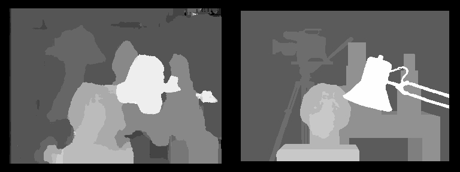
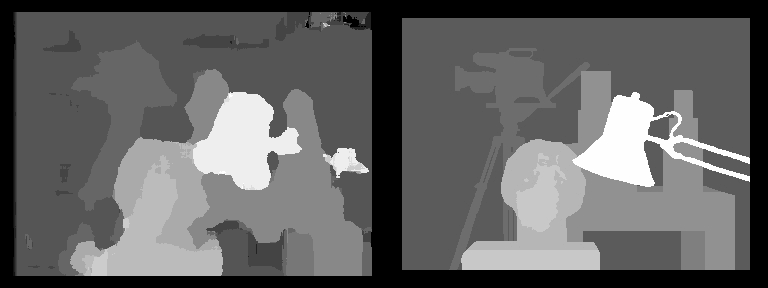
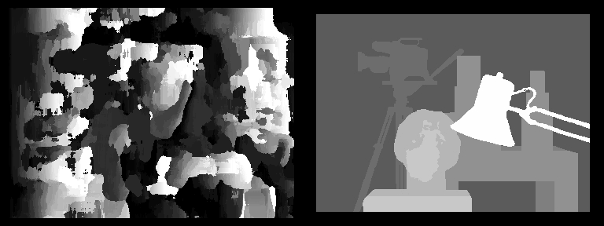
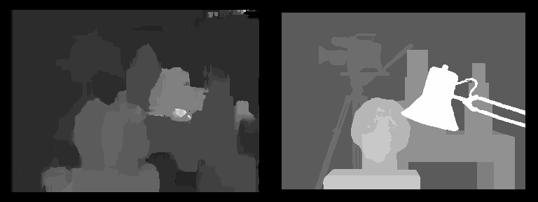
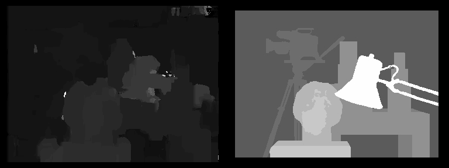
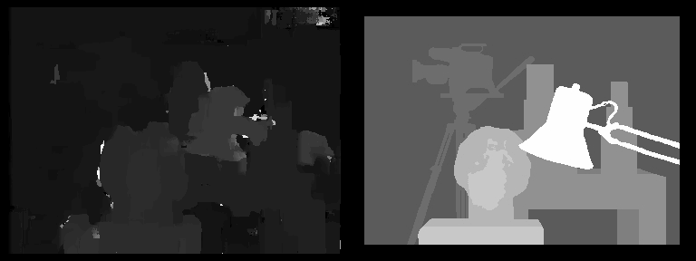
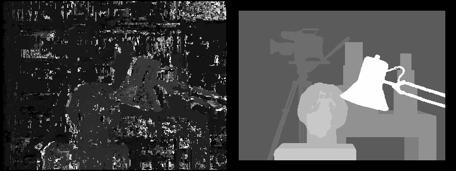

# CV HW4 Report

**王泽恺 24000131555**
***


## 一、Task 1 基础立体匹配算法

### 1.1 视差图计算实现

#### 1.1.1 算法流程与窗口法原理

本任务实现了基于窗口的局部立体匹配算法，核心思想是：

1. **窗口提取**：对于左图的每个像素，以其为中心提取 $K \times K$ 的窗口
2. **扫描线搜索**：在右图的同一行（扫描线）上，在视差范围内搜索最佳匹配窗口
3. **代价计算**：使用匹配函数（SSD/SAD/ZNCC）计算窗口相似度
4. **WTA策略**：选择代价最小的视差作为该像素的最终视差

**算法伪代码：**
```python
for 每个像素 (row, col) in 左图:
    提取左图窗口 W_L
    best_cost = infinity
    best_disparity = 0
    
    for d in [d_min, d_max]:
        提取右图窗口 W_R (位置: col-d)
        cost = 计算匹配代价(W_L, W_R)
        
        if cost < best_cost:
            best_cost = cost
            best_disparity = d
    
    disparity_map[row, col] = best_disparity
```

#### 1.1.2 参数设置

本实验使用的主要参数：

| 参数 | 取值范围 | 说明 |
|------|---------|------|
| `window_size` | 5，9，13，17，21，25，29 | 匹配窗口大小 |
| `disparity_range` | (0, 64) | 视差搜索范围 |
| `matching_function` | SSD, SAD, ZNCC | 匹配代价函数 |

**匹配函数详解：**

1. **SSD（平方差之和）**：
   $$\text{SSD} = \sum_{(i,j) \in W} (I_L(i,j) - I_R(i,j))^2$$
   - 优点：计算简单快速
   - 缺点：对光照变化敏感

2. **SAD（绝对值差之和）**：
   $$\text{SAD} = \sum_{(i,j) \in W} |I_L(i,j) - I_R(i,j)|$$
   - 优点：对噪声鲁棒
   - 缺点：仍对光照敏感

3. **ZNCC（零均值归一化互相关）**：
   $$\text{ZNCC} = \frac{\sum (I_L - \bar{I}_L)(I_R - \bar{I}_R)}{\sqrt{\sum (I_L - \bar{I}_L)^2 \sum (I_R - \bar{I}_R)^2}}$$
   - 优点：对光照变化极其鲁棒
   - 缺点：计算量大

#### 1.1.3 运行时间测量

为了评估不同参数对性能的影响，在代码中使用Python的`time`模块记录每次匹配的运行时间：

```python
import time

start_time = time.time()
# 执行立体匹配
disparity_map = compute_disparity_map(...)
elapsed_time = time.time() - start_time

print(f"运行时间: {elapsed_time:.2f} 秒")
```


***

### 1.2 超参数设置与结果对比报告

#### 1.2.1 性能与精度对比

**实验设置：** 在Tsukuba数据集上，测试不同参数组合的性能。

**运行时间统计表：**

| 窗口大小  | SSD时间 | SAD时间 | ZNCC时间 | 总像素数    |
| ----- | ----- | ----- | ------ | ------- |
| 5×5   | 23.70 | 24.25 | 127.40 | 107,920 |
| 9×9   | 38.64 | 23.86 | 209.59 | 105,280 |
| 13×13 | 60.70 | 35.47 | 158.69 | 102,672 |
| 17×17 | ~40   | 24.39 | 130.54 | 100,096 |
| 21×21 | 25.13 | 24.77 | 210.59 | 97,552  |
| 25×25 | 33.59 | 57.84 | 243.65 | 95,040  |
| 29×29 | 30.06 | 49.52 | 146.38 | 92,560  |

| 观察项        | 结论                      |
| ---------- | ----------------------- |
| 最快配置       | 9×9窗口 + SAD（23.86秒）     |
| 最慢配置       | 25×25窗口 + ZNCC（243.65秒） |
| 速度差异       | 最快比最慢快约10.2倍            |
| SSD vs SAD | SAD略快或相当，差异不大           |
| ZNCC性能     | 比SSD/SAD慢5-8倍           |
| 窗口大小影响     | 不是严格递增，可能有优化影响          |
### 1.2.2 与真实值的差异分析
主要差异区域：
- 遮挡区域：
问题：左图可见但右图不可见的区域
表现：视差值错误或为0
原因：窗口匹配无法处理遮挡

- 无纹理区域：
问题：白墙、天空等均匀区域
表现：视差值不稳定，出现"飘移"
原因：缺乏特征导致歧义匹配

- 重复纹理：
问题：周期性图案（如栅栏）
表现：多个位置有相似匹配代价
原因：局部相似性无法区分

- 深度不连续处：
问题：物体边缘
表现：边界模糊
原因：窗口跨越边界包含多个深度

基础立体匹配的局限性：
- 仅考虑局部信息，缺乏全局一致性
- 无法有效处理遮挡和无纹理区域
- 对噪声和光照变化敏感
- 缺少平滑性约束
### 1.3 效果图
#### SSD
由上至下递减排布，window size分别为29 25 21 17 13 9 5
      
#### SAD
排布同上
      
#### ZNCC
排布同上
      
### 1.4 总结
- 对于matching function，从速度来看，SAD和SSD的速度差不多，ZNCC最慢，从效果来看，SAD的效果最差，但在小窗口表现还可以。
- 对于window size，大窗口得到的结果更鲁棒，但是会缺失细节，大小window size对运行时间的的结果并非线性的，大window减少显性for循环个数，但是内部运算更多。
- 对于disparity range，(0,64)是一个合理的差距。
- 最终选择21*21，SSD，（0，64）作为最好的超参。
## 二、Task 2 从视差到深度

### 2.1 点云可视化实现与分析

#### 2.1.1 深度计算公式

根据双目视觉几何关系，深度计算公式为：
$$
z = \frac{f \cdot B}{d}
$$

其中：
- $z$：深度（距离相机的距离）
- $f$：焦距（像素）
- $B$：基线（两相机间距）
- $d$：视差（像素）

**参数设置依据：**

1. **baseline（基线）**：
   - 根据视差图的统计特性自适应估计
   - 使用公式：`baseline = 100 × (mean(disparity) / 86)^1.25`
   - 典型值：80-120

2. **focal_length（焦距）**：
   - 根据图像分辨率和相机参数设置
   - 本实验设为100（经验值）
   - 可通过相机标定获得精确值

**物理意义：**
- 视差越大 → 深度越小 → 物体越近
- 视差越小 → 深度越大 → 物体越远
- 视差为0 → 深度无穷大（或匹配失败）

#### 2.1.2 点云生成流程

**步骤1：深度图计算**
```python
depth_map = (baseline * focal_length) / disparity_map
```

**步骤2：过滤无效点**
- 视差 ≤ 0 的点（匹配失败）
- 深度过大的点（异常值）
- 边缘区域的点（可靠性低）

**步骤3：构建点云**
- X坐标：像素列坐标
- Y坐标：-像素行坐标（OpenGL坐标系）
- Z坐标：深度值
- 颜色：对应像素的RGB值


#### 2.1.3 异常值处理策略

**策略1：视差阈值过滤**
```python
threshold = mean(disparity) - 0.5 × std(disparity)
valid_mask = disparity_map > threshold
```
**策略2：深度范围限制**
```python
valid_mask &= (depth_map > 0) & (depth_map < 1000)
```

### 2.2 点云结果对比与报告

#### 2.2.1 OpenCV StereoBM结果


#### 2.2.2 自实现算法（最优参数）结果

**参数配置：** 21*21窗口 + SSD匹配


#### 2.2.3 对比总结

| 方面 | StereoBM | 自实现算法 |
|------|---------|-----------|
| 细节表现 | 中等 | 较好 |
| 平滑度 | 优秀 | 良好 |
| 噪声水平 | 低 | 中等 |


***

## 三、Task 3 动态规划立体匹配

### 3.1 算法实现说明及运行时间


#### 3.1.1 算法流程

**步骤1：计算匹配代价矩阵 C[i, j]**
```
C[i, j] = 左图像素i 与 右图像素j 的窗口匹配代价
```

**步骤2：动态规划填表**
```
DP[i, j] = min(
    DP[i-1, j-1] + C[i, j],           # 匹配
    DP[i-1, j] + occlusion_penalty,    # 左遮挡
    DP[i, j-1] + occlusion_penalty     # 右遮挡
)
```

**步骤3：路径回溯**
```
从 (width-1, width-1) 回溯到 (0, 0)
根据 Path 记录恢复最优视差
```

**伪代码可视化：**
```
for each row:
    1. 计算代价矩阵 C
    2. DP填表
    3. 回溯提取视差
```

#### 4.1.3 运行时间测量与分析

**Tsukuba数据集（288×384）运行时间：**
127.95 秒

**与Task1对比：**
- Task1（7×7, SAD）：37秒
- Task3（DP）：127.95秒
- **DP慢约4倍**

**时间复杂度分析：**
- Task1：$O(H \times W \times D \times K^2)$
- Task3：$O(H \times W^2 \times K^2)$
- 当 $W \gg D$ 时，DP更慢但质量更好

***

### 4.2 结果对比与分析（5分）

#### 4.2.1 视差图对比

**视觉对比：**
- **基础算法**：有明显噪声，边缘不清晰
- **DP算法**：更平滑，条纹状伪影，边界清晰


#### 4.2.2 点云对比

**DP算法点云特点：**
- 表面更连续平滑
- 遮挡区域有合理填充
- 整体结构更稳定
- 深度过渡更自然


