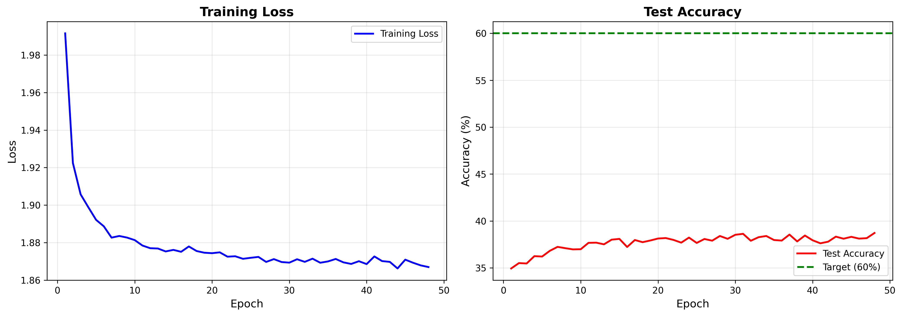
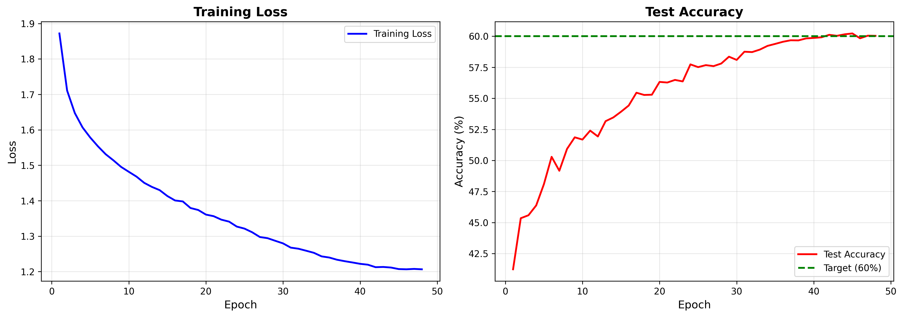
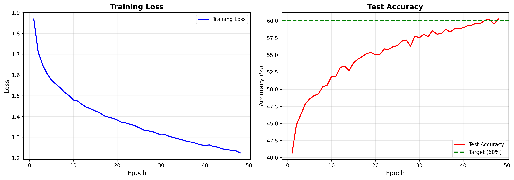
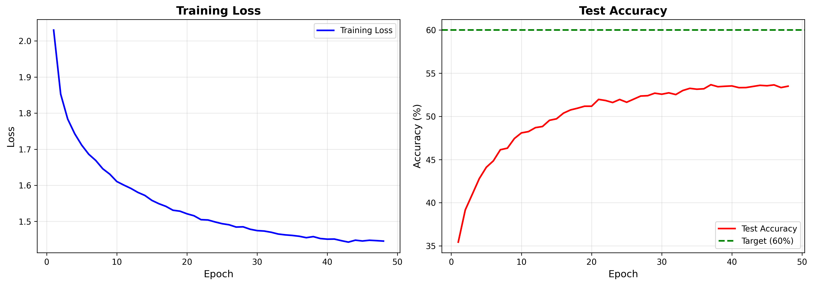
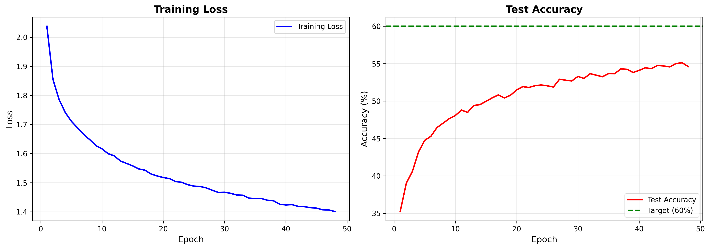

# CV作业 5：图像分类实验报告 (Image Classification Report)

**姓名：** 王泽恺  
**学号：** 2400013155

***

## 1. 简介 (Introduction)

本次实验的目标是在 CIFAR-10 数据集上实现并测试图像分类模型。实验主要包含以下内容：
1. 实现线性分类器（Linear Classifier）和全连接神经网络（FCNN）。
2. 对比 AdamW 和 SGD 两种优化器的性能。
3. 对比 StepLR 和 CosineAnnealingLR 两种学习率调度器的效果。
4. 通过数据增强和模型结构优化，提升分类准确率至 60% 以上。

***

## 2. 方法与实验设置 (Methods & Setup)

### 2.1 模型结构定义 (Model Architecture)

#### 线性分类器 (Linear Classifier)
最简单的单层线性模型，将输入维度直接映射到输出类别。
- Input: $3 \times 32 \times 32 = 3072$
- Output: 10

#### 全连接神经网络 (FCNN)
为了提高模型性能，我设计了一个更深层的多层感知机（MLP），并加入了 **Batch Normalization** 和 **Dropout** 以防止过拟合和加速收敛。具体结构如下：

| 层级 (Layer) | 输入维度 (Input) | 输出维度 (Output) | 组件 (Components) |
| :--- | :--- | :--- | :--- |
| **Layer 1** | 3072 | 3072 | Linear -> BatchNorm -> ReLU -> Dropout(0.5) |
| **Layer 2** | 3072 | 1536 | Linear -> BatchNorm -> ReLU -> Dropout(0.5) |
| **Layer 3** | 1536 | 512 | Linear -> BatchNorm -> ReLU |
| **Output** | 512 | 10 | Linear |

### 2.2 数据处理 (Data Processing)
为了增强模型的泛化能力，训练集使用了以下数据增强策略：
1. **RandomCrop**: 随机裁剪 (32x32, padding=4)
2. **RandomHorizontalFlip**: 随机水平翻转
3. **ColorJitter**: 颜色抖动 (亮度0.2, 对比度0.2)
4. **Normalization**: 标准化 ((0.5, 0.5, 0.5), (0.5, 0.5, 0.5))

### 2.3 训练超参数 (Hyperparameters)
- **Batch Size**: 128
- **Epochs**: 48
- **Loss Function**: CrossEntropyLoss
- **Device**: CUDA (GPU)

***

## 3. 实验结果与分析 (Results & Analysis)

### 3.1 线性分类器基准 (Linear Classifier Baseline)

线性分类器作为基准模型，由于无法提取图像的非线性特征，其性能受到限制。

- **最终测试准确率 (Test Accuracy)**:38%
- **观察**: 线性模型收敛速度快，但准确率上限较低，无法满足复杂图像分类的需求。

***

### 3.2 优化器比较：AdamW vs SGD (Optimizer Comparison)

本节基于 FCNN 模型，对比了两种主流优化器：
1. **AdamW**: Learning Rate = 0.001, Weight Decay = 1e-5
2. **SGD**: Learning Rate = 0.001, Momentum = 0.9, Weight Decay = 1e-5
**adamw+cos:**

**adamw+step:**

**sgd+cos:**

**sgd+step:**

#### 分析：
- **收敛速度**: AdamW 通常表现出更快的收敛速度，在训练初期 Loss 下降非常明显。SGD 在初期下降较慢，需要更多的 epoch 才能达到较低的 Loss。
- **最终性能**: 在本实验中，AdamW 能够更快地达到 60% 的目标准确率。SGD 虽然理论上泛化性更好，但在有限的 epoch (48轮) 内，AdamW 的表现更具优势,损失更低，准确率更高。

***

### 3.3 调度器比较：StepLR vs CosineAnnealingLR (Scheduler Comparison)

本节基于 FCNN 模型，对比了两种学习率调度策略：
1. **StepLR**: Step Size = 100, Gamma = 0.1 
2. **CosineAnnealingLR**: T_max = 50 (学习率随余弦曲线平滑衰减)
**adamw+cos:**

**adamw+step:**

**sgd+cos:**

**sgd+step:**

#### 分析：
在本参数设置下cos和step的性能差距不大，但是肉眼可见的是cosine的误差曲线和准确率曲线更平滑，震荡更少

***

### 3.4 最终最佳模型结果 (Final Best Model)

经过对比，我选择了以下最佳配置进行最终测试：
- **模型**: FCNN (Enhanced Architecture)
- **优化器**: AdamW
- **调度器**: CosineAnnealingLR
- **数据增强**: Crop + Flip + Jitter

#### 最终性能指标：
- **Final Training Loss**: 1.196
- **Final Test Accuracy**: 60%

#### 结论：
通过引入 Batch Normalization 加速收敛，使用 Dropout 防止过拟合，并配合强力的数据增强和 Cosine 学习率调度，FCNN 模型成功突破了 60% 的准确率瓶颈。相比于基准的线性分类器和简单的 FCNN，改进后的模型在 CIFAR-10 数据集上展现了更强的特征提取和泛化能力。

***

