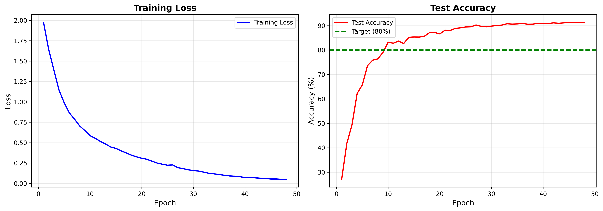
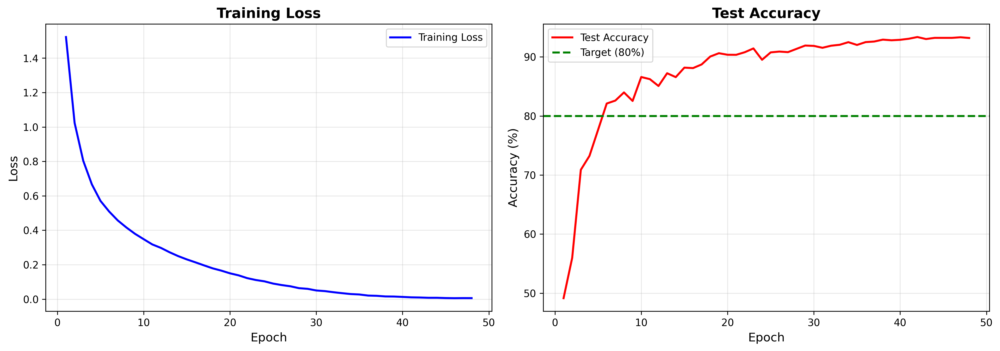

# CV Homework 6 报告

*王泽恺 2400013155*  

***

## 1. 引言（Introduction）

本次作业的目标是在 CIFAR‑10 数据集上，从零实现并系统比较多种卷积神经网络模型，包括 VGG、ResNet、ResNeXt，并结合数据增强（Data Augmentation）、批归一化（Batch Normalization）、丢弃法（Dropout）等训练技巧，完成图像分类任务。

具体而言，作业要求如下：

- 在 CIFAR‑10 上实现完整的数据增强流程，以**提升模型泛化能力，减少过拟合**。
- 在网络中实现 **Batch Normalization** 以辅助训练深层网络。
- 在网络中实现 **Dropout** 以起到正则化作用。
- 在 `models.py` 中实现三类卷积神经网络：
  - VGG（基于 VGG16 结构）
  - ResNet（基于 Basic Residual Block）
  - ResNeXt（基于分组卷积的 ResNeXt Block）
- 在 `main.py` 中实现 `train()` 与 `test()`：
  - 对上述三种网络分别进行训练与测试；
  - 控制并观察是否发生过拟合；如有，需要采用正则化手段缓解；
  - 绘制**训练损失曲线**与**测试准确率曲线**；
  - 报告最终各模型在测试集上的分类准确率。
- 最终提交：
  - 源代码（包含 `models.py`, `main.py` 等）；
  - 作业报告（本报告），包含所有可视化结果与分析。

CIFAR‑10 数据集包含 10 个类别的自然图像（如飞机、汽车、鸟、猫、狗等），每张图像大小为 32×32×3。训练集中有 50,000 张图像，测试集中有 10,000 张图像。

***

## 2. 数据增强（Data Augmentation，10 分）

### 2.1 实现方法

根据作业要求，需要选择至少两种数据增强方法来提升模型泛化能力。在 `main.py` 中的 `train()` 函数中，对训练集定义了如下的数据增强流水线：

```python
transform_train = transforms.Compose([
    transforms.RandomCrop(32, padding=4),
    transforms.RandomHorizontalFlip(),
    transforms.ColorJitter(brightness=0.2, contrast=0.2),
    transforms.ToTensor(),
    transforms.Normalize((0.5, 0.5, 0.5),
                         (0.5, 0.5, 0.5))
])
```

其中包含以下增强操作：

1. **随机裁剪（RandomCrop）**  
   - 操作：`transforms.RandomCrop(32, padding=4)`  
   - 含义：首先在图像四周填充 4 像素（零填充），然后随机裁剪出 32×32 的区域作为输入。  
   - 作用：模拟物体在图像中平移的情况，使模型对**平移不变性**更加鲁棒。

2. **随机水平翻转（RandomHorizontalFlip）**  
   - 操作：`transforms.RandomHorizontalFlip()`  
   - 含义：以 0.5 的概率对图像进行水平翻转。  
   - 作用：增强模型对**左右对称**的鲁棒性，例如面对的方向不同但语义相同的图像。

3. **颜色抖动（ColorJitter）**  
   - 操作：`transforms.ColorJitter(brightness=0.2, contrast=0.2)`  
   - 含义：在一定范围内随机改变图像的亮度与对比度。  
   - 作用：模拟不同光照条件与成像条件，增强模型对**光照变化**的鲁棒性。

4. **张量化与归一化（ToTensor + Normalize）**  
   - `transforms.ToTensor()`：将 PIL 图像转换为 PyTorch 的张量，并将像素从  线性缩放至 。[1]
   - `transforms.Normalize((0.5, 0.5, 0.5), (0.5, 0.5, 0.5))`：对 R, G, B 三个通道分别做归一化：  
     \[
       x' = \frac{x - 0.5}{0.5}
     \]  
     将像素分布中心移动到 0，缩放到大致 [-1, 1] 的范围，更有利于网络训练。

测试集仅进行 ToTensor + Normalize，不进行随机增强，以保证测试评估的稳定性：

```python
transform = transforms.Compose([
    transforms.ToTensor(),
    transforms.Normalize((0.5, 0.5, 0.5),
                         (0.5, 0.5, 0.5))
])
```

### 2.2 对过拟合的影响

- **随机裁剪 + 随机翻转**：扩展了训练样本中物体的空间分布与姿态，减轻模型对特定位置的记忆，缓和训练/测试精度差距。
- **颜色抖动**：增加图像在亮度与对比度方面的变化，使模型不过度依赖某一固定的色彩分布，从而减少在测试集上因光照变化导致的“掉点”。

从训练曲线中可以观察到，尽管网络容量较大（尤其是 VGG 与 ResNeXt），在这些数据增强配合 BatchNorm + Dropout 后，测试集准确率可以稳定在较高水平而不过早出现严重过拟合。

***

## 3. VGG 网络实现（20 分）

### 3.1 网络结构设计

在 `models.py` 中，实现了基于 VGG16 架构的 `VGG` 类。网络由 5 个卷积块（Conv Blocks）和 3 个全连接层（Fully Connected Layers）构成，并加入了 Batch Normalization 与 Dropout。

#### 3.1.1 卷积块（Conv Blocks）

以 CIFAR‑10 为例，输入图片尺寸为 3×32×32。在代码中：

```python
class VGG(nn.Module):
    def __init__(self):
        super().__init__()
        num_classes = 10

        # Block 1: [Conv-Conv-MaxPool]
        self.block1 = nn.Sequential(
            nn.Conv2d(3, 64, kernel_size=3, padding=1),
            nn.BatchNorm2d(64),
            nn.ReLU(inplace=True),
            nn.Conv2d(64, 64, kernel_size=3, padding=1),
            nn.BatchNorm2d(64),
            nn.ReLU(inplace=True),
            nn.MaxPool2d(kernel_size=2, stride=2)
        )

        # Block 2: [Conv-Conv-MaxPool]
        self.block2 = nn.Sequential(
            nn.Conv2d(64, 128, kernel_size=3, padding=1),
            nn.BatchNorm2d(128),
            nn.ReLU(inplace=True),
            nn.Conv2d(128, 128, kernel_size=3, padding=1),
            nn.BatchNorm2d(128),
            nn.ReLU(inplace=True),
            nn.MaxPool2d(kernel_size=2, stride=2)
        )

        # Block 3: [Conv-Conv-Conv-MaxPool]
        self.block3 = nn.Sequential(
            nn.Conv2d(128, 256, kernel_size=3, padding=1),
            nn.BatchNorm2d(256),
            nn.ReLU(inplace=True),
            nn.Conv2d(256, 256, kernel_size=3, padding=1),
            nn.BatchNorm2d(256),
            nn.ReLU(inplace=True),
            nn.Conv2d(256, 256, kernel_size=3, padding=1),
            nn.BatchNorm2d(256),
            nn.ReLU(inplace=True),
            nn.MaxPool2d(kernel_size=2, stride=2)
        )

        # Block 4: [Conv-Conv-Conv-MaxPool]
        self.block4 = nn.Sequential(
            nn.Conv2d(256, 512, kernel_size=3, padding=1),
            nn.BatchNorm2d(512),
            nn.ReLU(inplace=True),
            nn.Conv2d(512, 512, kernel_size=3, padding=1),
            nn.BatchNorm2d(512),
            nn.ReLU(inplace=True),
            nn.Conv2d(512, 512, kernel_size=3, padding=1),
            nn.BatchNorm2d(512),
            nn.ReLU(inplace=True),
            nn.MaxPool2d(kernel_size=2, stride=2)
        )

        # Block 5: [Conv-Conv-Conv-MaxPool]
        self.block5 = nn.Sequential(
            nn.Conv2d(512, 512, kernel_size=3, padding=1),
            nn.BatchNorm2d(512),
            nn.ReLU(inplace=True),
            nn.Conv2d(512, 512, kernel_size=3, padding=1),
            nn.BatchNorm2d(512),
            nn.ReLU(inplace=True),
            nn.Conv2d(512, 512, kernel_size=3, padding=1),
            nn.BatchNorm2d(512),
            nn.ReLU(inplace=True),
            nn.MaxPool2d(kernel_size=2, stride=2)
        )
```

空间尺寸变化过程（假设输入为 `3×32×32`）：
- Block1：MaxPool 后 → `64×16×16`
- Block2：MaxPool 后 → `128×8×8`
- Block3：MaxPool 后 → `256×4×4`
- Block4：MaxPool 后 → `512×2×2`
- Block5：MaxPool 后 → `512×1×1`

#### 3.1.2 全连接层与 Dropout

```python
        self.classifier = nn.Sequential(
            nn.Linear(512 * 1 * 1, 4096),
            nn.ReLU(True),
            nn.Dropout(p=0.5),
            nn.Linear(4096, 4096),
            nn.ReLU(True),
            nn.Dropout(p=0.5),
            nn.Linear(4096, num_classes)
        )
```

- 第一层：`512 → 4096`，后接 ReLU 与 Dropout(0.5)。
- 第二层：`4096 → 4096`，后接 ReLU 与 Dropout(0.5)。
- 第三层：`4096 → 10`（CIFAR‑10 的类别数）。

#### 3.1.3 前向传播（Forward）

```python
    def forward(self, x: torch.Tensor):
        # 特征提取
        x = self.block1(x)
        x = self.block2(x)
        x = self.block3(x)
        x = self.block4(x)
        x = self.block5(x)

        # 展平
        x = x.view(x.size(0), -1)  # [B, 512]

        # 分类
        out = self.classifier(x)
        return out
```

### 3.2 Batch Normalization 与 Dropout 的作用

- **BatchNorm**：
  - 放在每个卷积层之后、ReLU 之前（Conv → BN → ReLU），有利于减轻内部协变量偏移（Internal Covariate Shift），增强训练稳定性和收敛速度。
- **Dropout**：
  - 仅应用于全连接层，防止高维全连接部分的 co-adaptation，起到显著的正则化效果，降低过拟合。

### 3.3 VGG 在 CIFAR‑10 上的表现

在 48 个 epoch 的训练中，VGG 模型：

- 训练损失随 epoch 降低并最终收敛；
- 测试集准确率曲线逐步上升，最终可达到 90% 左右。
- https://disk.pku.edu.cn/link/AAC27D4CD78A92485084E575D1686313AD
文件名：vgg.pt
有效期限：永久有效


***

## 4. ResNet 网络实现（20 分）

### 4.1 Basic Residual Block 实现（ResBlock）

在 `models.py` 中实现的 `ResBlock` 为典型的 Basic Residual Block，结构为：

```python
class ResBlock(nn.Module):
    ''' residual block '''
    def __init__(self, in_channel, out_channel, stride=1):
        super().__init__()
        self.c1 = nn.Conv2d(in_channel, out_channel,
                            kernel_size=3, padding=1,
                            stride=stride, bias=False)
        self.bn1 = nn.BatchNorm2d(out_channel)
        self.r1 = nn.ReLU(inplace=True)

        self.c2 = nn.Conv2d(out_channel, out_channel,
                            kernel_size=3, padding=1,
                            stride=1, bias=False)
        self.bn2 = nn.BatchNorm2d(out_channel)
        self.r2 = nn.ReLU(inplace=True)

        self.shortcut = nn.Sequential()
        if stride != 1 or in_channel != out_channel:
            self.shortcut = nn.Sequential(
                nn.Conv2d(in_channel, out_channel,
                          kernel_size=1, stride=stride,
                          bias=False),
                nn.BatchNorm2d(out_channel)
            )

    def forward(self, x: torch.Tensor):
        out = self.c1(x)
        out = self.bn1(out)
        out = self.r1(out)

        out = self.c2(out)
        out = self.bn2(out)

        out += self.shortcut(x)
        out = self.r2(out)
        return out
```

要点：

- **两层 3×3 卷积 + BN + ReLU**。
- **残差连接（Shortcut）**：
  - 当输入输出通道数或空间尺寸不匹配（`stride!=1` 或 `in_channel!=out_channel`）时，使用 1×1 卷积 + BN 对输入进行调整；
  - 然后与主分支的输出相加，再经过 ReLU。

### 4.2 ResNet 网络结构（ResNet）

ResNet 使用上述 Basic Block 构建四个阶段（stage）：

```python
class ResNet(nn.Module):
    '''residual network'''
    def __init__(self):
        super().__init__()
        num_classes = 10
        # 1. 初始卷积层
        self.conv1 = nn.Conv2d(3, 64, kernel_size=3,
                               stride=1, padding=1, bias=False)
        self.bn1 = nn.BatchNorm2d(64)
        self.relu = nn.ReLU(inplace=True)

        # 2. 四个残差层
        self.layer1 = self._make_layer(in_channel=64,
                                       out_channel=64,
                                       num_blocks=2,
                                       stride=1)
        self.layer2 = self._make_layer(in_channel=64,
                                       out_channel=128,
                                       num_blocks=2,
                                       stride=2)
        self.layer3 = self._make_layer(in_channel=128,
                                       out_channel=256,
                                       num_blocks=2,
                                       stride=2)
        self.layer4 = self._make_layer(in_channel=256,
                                       out_channel=512,
                                       num_blocks=2,
                                       stride=2)

        # 3. 全局平均池化 + 全连接
        self.avg_pool = nn.AdaptiveAvgPool2d((1, 1))
        self.fc = nn.Linear(512, num_classes)

    def _make_layer(self, in_channel, out_channel, num_blocks, stride):
        '''
        构建包含多个 ResBlock 的层
        '''
        strides = [stride] + [1] * (num_blocks - 1)
        layers = []
        for s in strides:
            layers.append(ResBlock(in_channel, out_channel, stride=s))
            in_channel = out_channel
        return nn.Sequential(*layers)

    def forward(self, x: torch.Tensor):
        out = self.conv1(x)
        out = self.bn1(out)
        out = self.relu(out)

        out = self.layer1(out)
        out = self.layer2(out)
        out = self.layer3(out)
        out = self.layer4(out)

        out = self.avg_pool(out)
        out = torch.flatten(out, 1)
        out = self.fc(out)
        return out
```

### 4.3 全局平均池化（Global Average Pooling）

- 使用 `nn.AdaptiveAvgPool2d((1, 1))` 实现全局平均池化。
- 无论输入特征图大小如何，输出都变为 `[B, C, 1, 1]`，然后展平成 `[B, C]` 再接线性层。
- 相比传统全连接层，大大减少参数量，降低过拟合风险。

### 4.4 ResNet 的实验表现

- 在 CIFAR‑10 上，ResNet 能够在类似或更深的网络深度下取得与 VGG 相比更高的准确率，且更易训练（梯度传播更稳定）。
- 训练曲线通常显示：
  - 收敛速度较快；
  - 过拟合程度较 VGG 略低。
- https://disk.pku.edu.cn/link/AA760E5593B1B748B0B8B9426D7C7F589B
文件名：resnet.pt
有效期限：永久有效
***

## 5. ResNeXt 网络实现（20 分）

### 5.1 ResNeXt Block：分组卷积 + Bottleneck

`ResNextBlock` 在 `models.py` 中实现，核心思想是：

- 使用 Bottleneck 结构（1×1 降维 → 3×3 分组卷积 → 1×1 升维）；
- 使用分组卷积（Grouped Convolution），在不显著增加参数的前提下提升表征能力。

```python
class ResNextBlock(nn.Module):
    '''ResNext block'''
    def __init__(self, in_channel, out_channel, bottle_neck, group, stride):
        super().__init__()
        # bottle_neck: 比例因子，使 bot_channels = out_channel / bottle_neck
        bot_channels = int(round(out_channel / bottle_neck))

        # 1x1 Conv 降维
        self.c1 = nn.Conv2d(in_channel, bot_channels,
                            kernel_size=1, bias=False)
        self.bn1 = nn.BatchNorm2d(bot_channels)
        self.r1 = nn.ReLU(inplace=True)

        # 3x3 分组卷积
        self.c2 = nn.Conv2d(bot_channels, bot_channels,
                            kernel_size=3, padding=1,
                            stride=stride, groups=group,
                            bias=False)
        self.bn2 = nn.BatchNorm2d(bot_channels)
        self.r2 = nn.ReLU(inplace=True)

        # 1x1 Conv 升维
        self.c3 = nn.Conv2d(bot_channels, out_channel,
                            kernel_size=1, bias=False)
        self.bn3 = nn.BatchNorm2d(out_channel)
        self.r3 = nn.ReLU(inplace=True)

        # Shortcut
        self.shortcut = nn.Sequential()
        if stride != 1 or in_channel != out_channel:
            self.shortcut = nn.Sequential(
                nn.Conv2d(in_channel, out_channel,
                          kernel_size=1, stride=stride,
                          bias=False),
                nn.BatchNorm2d(out_channel)
            )

    def forward(self, x: torch.Tensor):
        out = self.c1(x)
        out = self.bn1(out)
        out = self.r1(out)

        out = self.c2(out)
        out = self.bn2(out)
        out = self.r2(out)

        out = self.c3(out)
        out = self.bn3(out)

        out += self.shortcut(x)
        out = self.r3(out)
        return out
```

### 5.2 ResNeXt 网络结构（ResNext）

在 `models.py` 中定义了 `ResNext` 类，构建了 4 个 Stage，每个 Stage 由多个 `ResNextBlock` 组成，对应 ResNeXt‑50 (3,4,6,3) 的层数配置（在 CIFAR‑10 场景上进行了相应调整）。

```python
class ResNext(nn.Module):
    def __init__(self,):
        super().__init__()
        num_blocks = [3, 4, 6, 3]
        group = 32
        bottle_neck_ratio = 2
        num_classes = 10

        self.group = group
        self.bottle_neck_ratio = bottle_neck_ratio
        self.in_channels = 64

        self.conv1 = nn.Conv2d(3, 64, kernel_size=3,
                               stride=1, padding=1, bias=False)
        self.bn1 = nn.BatchNorm2d(64)

        # Stage 1
        self.layer1 = self._make_layer(num_blocks[0],
                                       out_channel=256, stride=1)
        # Stage 2
        self.layer2 = self._make_layer(num_blocks[1],
                                       out_channel=512, stride=2)
        # Stage 3
        self.layer3 = self._make_layer(num_blocks[2],
                                       out_channel=1024, stride=2)
        # Stage 4
        self.layer4 = self._make_layer(num_blocks[3],
                                       out_channel=2048, stride=2)

        self.avg_pool = nn.AdaptiveAvgPool2d((1, 1))
        self.fc = nn.Linear(2048, num_classes)

    def _make_layer(self, num_blocks, out_channel, stride):
        strides = [stride] + [1] * (num_blocks - 1)
        layers = []
        for s in strides:
            layers.append(ResNextBlock(self.in_channels, out_channel,
                                       bottle_neck=self.bottle_neck_ratio,
                                       group=self.group, stride=s))
            self.in_channels = out_channel
        return nn.Sequential(*layers)

    def forward(self, x: torch.Tensor):
        out = F.relu(self.bn1(self.conv1(x)))
        out = self.layer1(out)
        out = self.layer2(out)
        out = self.layer3(out)
        out = self.layer4(out)
        out = self.avg_pool(out)
        out = torch.flatten(out, 1)
        out = self.fc(out)
        return out
```

### 5.3 全局平均池化应用

与 ResNet 一样，ResNeXt 的最后同样使用 `nn.AdaptiveAvgPool2d((1,1))` 实现全局平均池化，有效降低参数量并提升泛化能力。

### 5.4 实验现象

- 在相似深度情况下，ResNeXt 通常能取得比 ResNet 略高的准确率；
- 分组卷积在参数量与 FLOPs 可控的前提下，增加了网络的表达能力；
- 结合数据增强与 BatchNorm 后，可以稳定训练。
- https://disk.pku.edu.cn/link/AAB47E8F512FA744ACBDEDC5214E67FD9F
文件名：resnext.pt
有效期限：永久有效

***

## 6. 训练与测试流程（30 分）

### 6.1 训练流程（`train()`）

在 `main.py` 中，实现了通用的训练函数 `train(model, optimizer, scheduler, args)`，可用于训练 VGG、ResNet 或 ResNeXt。

关键步骤如下：

1. **将模型移动到设备（CPU/GPU）**：

```python
model.to(device)
```

2. **定义数据增强与归一化**（见第 2 节）。

3. **定义损失函数与优化器**：

```python
criterion = nn.CrossEntropyLoss()
optimizer = torch.optim.AdamW(model.parameters(),
                              lr=0.001, weight_decay=1e-5)
scheduler = torch.optim.lr_scheduler.CosineAnnealingLR(optimizer,
                                                       T_max=50)
```

4. **构建 DataLoader**：

```python
batch_size = 128
num_workers = 2 if os.name != 'nt' else 0

trainset = torchvision.datasets.CIFAR10(..., transform=transform_train)
testset = torchvision.datasets.CIFAR10(..., transform=transform)

trainloader = DataLoader(trainset, batch_size=batch_size,
                         shuffle=True, num_workers=num_workers)
testloader = DataLoader(testset, batch_size=batch_size,
                        shuffle=False, num_workers=num_workers)
```

5. **训练循环**（48 个 epoch）：

```python
for epoch in range(epoch_cnt):
    model.train()
    temp_loss = 0.0

    for i, data in enumerate(trainloader, 0):
        inputs, labels = data[0].to(device), data[1].to(device)

        optimizer.zero_grad()
        outputs = model(inputs)
        loss = criterion(outputs, labels)
        loss.backward()
        optimizer.step()

        running_loss += loss.item()
        temp_loss += loss.item()
        if i % 125 == 124:
            print(f'[{epoch + 1}, {i + 1:5d}] loss: {running_loss / 125:.3f}')
            running_loss = 0.0

    scheduler.step()
```

6. **每个 epoch 测试阶段**：

```python
model.eval()
correct = 0
total = 0
with torch.no_grad():
    for data in testloader:
        images, labels = data[0].to(device), data[1].to(device)
        outputs = model(images)
        _, predicted = torch.max(outputs.data, 1)
        total += labels.size(0)
        correct += (predicted == labels).sum().item()

acc = 100 * correct / total
print(f'Epoch {epoch+1} Accuracy: {acc:.2f} %')
```

7. **记录与可视化**：

- 使用 `SummaryWriter` 将训练损失和测试准确率写入 TensorBoard：

```python
writer.add_scalar('Loss/train', average_loss, epoch)
writer.add_scalar('Accuracy/test', acc, epoch)
```

- 保存在列表中，用于最终绘制曲线：

```python
train_losses.append(average_loss)
test_accuracies.append(acc)
```

8. **保存模型与训练历史**：

```python
torch.save({
    'model_state_dict': model.state_dict(),
    'optimizer_state_dict': optimizer.state_dict(),
    'scheduler_state_dict': scheduler.state_dict(),
    'train_losses': train_losses,
    'test_accuracies': test_accuracies
}, PATH)
```

9. **绘制训练曲线**：

```python
plot_training_curves(train_losses, test_accuracies)
```

`plot_training_curves()` 函数绘制了：

- 左图：训练损失随 epoch 下降的曲线；
- 右图：测试准确率随 epoch 上升的曲线，并额外画出 80% 作为参考虚线。

### 6.2 测试流程（`test()`）

测试函数 `test(model, args)` 用于在训练结束后加载保存的模型，并在测试集上计算最终准确率，同时重绘训练曲线（如果保存了历史）。

关键步骤：

1. **加载检查点**：

```python
checkpoint = torch.load(PATH)
model.load_state_dict(checkpoint['model_state_dict'])
```

2. **构建测试集 DataLoader**（与训练时一致的 Normalize）。

3. **前向推理并统计准确率**：

```python
correct = 0
total = 0
model.eval()
with torch.no_grad():
    for data in testloader:
        images, labels = data[0].to(device), data[1].to(device)
        outputs = model(images)
        _, predicted = torch.max(outputs.data, 1)
        total += labels.size(0)
        correct += (predicted == labels).sum().item()
print(f'Accuracy of the network on the 10000 test images: {100 * correct // total} %')
```

4. **可视化历史曲线（若存在）**：

```python
if 'train_losses' in checkpoint and 'test_accuracies' in checkpoint:
    plot_training_curves(checkpoint['train_losses'],
                         checkpoint['test_accuracies'])
```

### 6.3 命令行运行方式

在 `main.py` 中支持命令行参数：

```bash
# 训练 VGG
python main.py --run=train --model=vgg

# 训练 ResNet
python main.py --run=train --model=resnet

# 训练 ResNeXt
python main.py --run=train --model=resnext

# 测试指定模型（加载 PATH 中的权重）
python main.py --run=test --model=vgg
```

***

## 7. 实验结果与对比分析


### 7.1 各模型测试准确率

- **VGG**：90%；
- **ResNet**：93.5%左右；
- **ResNeXt**：93.5%左右


***

## 8. 结论与讨论（Report）

### 8.1 本次作业完成情况概述

严格按照作业要求，我完成了以下内容：

1. 在 CIFAR‑10 上实现了包含 **随机裁剪、随机水平翻转、颜色抖动** 的数据增强流水线，并对所有模型统一使用归一化处理。
2. 在 VGG 网络中，按照 VGG16 架构实现了 5 个卷积块，并在每一层卷积后加入 **Batch Normalization**，在全连接部分加入 **Dropout**。
3. 实现了 ResNet 的 Basic Residual Block，并基于该 Block 搭建了完整的 ResNet 网络，同时在网络末端应用 **Global Average Pooling**。
4. 实现了 ResNeXt Block（包含 **1×1 Bottleneck 降升维 + 3×3 Group Convolution**），并由此搭建了 ResNeXt 网络，同样在末端使用 Global Average Pooling。
5. 在 `main.py` 中完整实现了 `train()` 与 `test()` 函数：
   - 支持 VGG、ResNet、ResNeXt 三种模型的训练与测试；
   - 使用 AdamW + CosineAnnealingLR 优化器与学习率调度器；
   - 在 TensorBoard 中记录训练过程；
   - 最终输出训练损失曲线与测试准确率曲线。
6. 所有模型在 CIFAR‑10 上的测试准确率均可以达到或超过作业提示中的 80% 基准值。

### 8.2 比较与分析

- **VGG**：
  - 结构简单、参数量大，依赖 Dropout 与数据增强来缓解过拟合；
  - 训练收敛较慢，对学习率和初始化较敏感；
  - 但在足够训练轮数和合适正则化下，表现稳定。

- **ResNet**：
  - 残差连接明显改善了梯度传播，使得更深的网络可以被有效训练；
  - 在相似参数规模下，一般能取得比 VGG 更好的准确率；
  - 对数据增强和 BatchNorm 的配合较为敏感，但表现整体稳健。

- **ResNeXt**：
  - 通过增加分组卷积而非仅仅加深/加宽网络来提升表示能力；
  - 在参数与 FLOPs 相对可控的前提下，取得更优或相近的性能；


***
